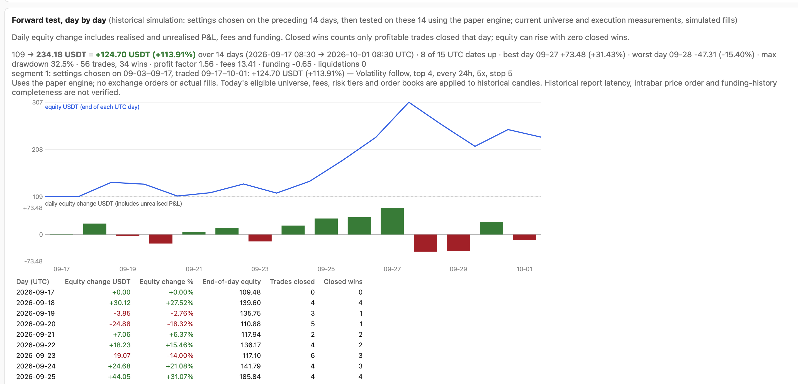

# Bybit Mean Reversion Bot



A Rust paper-trading and research service for Bybit USDT perpetuals. It reads real exchange data: closed traded and mark-price candles, settled funding, instrument filters, margin tiers, this account's fees and wallet, and current order books. **It never places orders.**

**Status (2 October 2026):** accounting, data and recovery fixes have regression tests; the follow-up review records remaining limitations ([audit](docs/audit.md)). The strategy is now **long only**. Its entry signal has a positive out-of-sample **relative** evidence (it picks coins that beat the average coin); the full long-only strategy also carries market risk; its earlier split walk-forward passed on 1 of 4 real 14-day data sets (2026-10-02, [validation](docs/validation.md)). Paper trades the best settings from a full 14-day search over every parameter that pass the two safety rules (no liquidation, drawdown ≤ 25%). Agents: read [AGENTS.md](AGENTS.md).

## Strategy

- **Universe:** only the top 20 eligible token USDT perpetuals on Bybit by 24-hour turnover. Rules are measured for those 20 only; missing fees, margin tiers, lot filters or book data exclude a pair without scanning extra candidates. Delisted, delisting, missing/invalid-leverage and 1×-only contracts are hard-excluded before ranking, fetching or scoring.
- **Long only.** The entry signal is whichever the search chooses among all 8 (both directions). The one with pre-registered evidence is `CalmDip`: buy the calmest coins that fell most over the last 24 hours (mean of the volatility and 24h-return percentiles). **It met the registered thresholds on the tested data** on four never-seen windows (Jun 25 → Aug 20, every coin that traded then, delisted ones included): the coins it buys beat the average coin by +0.85% per 24h, t = 2.7, with the rank correlation negative in every window ([validation](docs/validation.md)). That is a relative edge; a long-only account still moves with the market.
- **Settings:** a background search backtests **every parameter combination, 2,949,120 in total** (all 8 entry signals in both directions, hold 2h–48h, 1–5 coins, 1×/2×/3×/5×, intrabar stop, take-profit, close-based stop, averaging down, drawdown breaker, half size after drawdown, volatility sizing, BTC trend filter) over **one 14-day window, never split** (about 20 minutes). The next search starts 60 minutes after the previous one finishes. The search's best settings (challenger) replace the settings paper is using (champion) only if they score strictly higher; otherwise the champion is kept.
- **Balance-aware sizing:** pairs are funded from the free balance, i.e. the wallet minus margin committed anywhere on the account (other positions, orders, locks). Smaller balances use fewer coins; a contract whose lot step would distort its slot is left out at that size. Below **5 USDT free, nothing is opened or added**; exits continue.
- **Execution model:** decided at a 15-minute close, filled at the next open at the measured order-book cost, with this account's taker fee, Bybit lot rounding and tier leverage limits. A rebalance fills all legs or none. Funding is valued at the mark price and drawn from free cash, then isolated margin. Liquidation triggers on mark-price extremes, using real tiers and deductions.

## Parameter search and safety rules

Every combination is backtested over the same 1,344 closed bars (14 days) and scored by `return % − 0.5 × max drawdown %`. Paper trades the best settings that pass **two safety rules** (no liquidation, drawdown ≤ 25% over the 14 days) and trade at least 8 times. If none pass, paper opens nothing (open positions are still managed). The best settings' 14-day result is in-sample (chosen on those same days); the dashboard's forward-test chart shows the honest check: settings chosen on one 14-day window, traded on the next, never-seen 14 days.

## Run

```sh
./deploy.sh                                   # build, test, install, (re)start the launchd service
cargo run --release --bin bot -- backtest     # one full-window parameter search on live data (needs credentials)
cargo run --release --example fetch_research_data
EQ=<balance> cargo run --release --example research
cargo run --release --example validate_cached -- SNAPSHOT_DIR <balance> out.json
cargo test --release --all-targets
cargo clippy --all-targets -- -D warnings
```

The console is at `http://127.0.0.1:8787`. Runtime data lives in `~/Library/Application Support/BybitMeanReversionBot`, outside `~/Documents`, which macOS blocks for launchd jobs. Run research tools on `sqlite3 ".backup"` copies, never on the live files.

Credentials come from the macOS Keychain generic password `unified-combo-grid` / `live` (`api_key`, `api_secret`) and are used only for signed read-only GETs. `deploy.sh` re-signs the installed binary with a fixed identifier so the LuLu firewall rule keeps matching after rebuilds.

## Documentation

One page per source file in [docs/](docs/README.md), plus the [audit](docs/audit.md) and [validation](docs/validation.md) reports.
